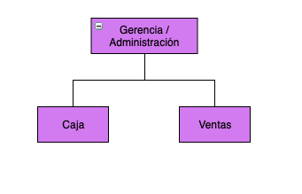

# Descripción de la Empresa

## 1. Descripción y naturaleza de la empresa

**Variedades de to pa to**, es una empresa pequeña empresa privada que se dedica a la comercialización de artículos variados cómo son prendas y accesorios de vestir, calzado, productos de belleza y cuidado de la piel, así como también artículos escolares. Cuenta con un personal de 6 personas, las cuales se distribuyen en dos horarios, 3 personas de 8am a 4pm y 3 personas de 1pm a 9pm. En el local también se ofrecen otros servicios como son el pago de servicios eléctricos y recargas a celulares.

## 2. Misión, Visión, valores y objetivos de la empresa

**Misión:**
Poner a disposición de nuestros clientes, artículos de calidad a precios accesibles. Ofreciendo una experiencia de compra que haga la vida más práctica y feliz.

**Visión:**
Ser la empresa de ventas al detalle preferida, tanto nacional como internacional con la comercialización de productos nacionales en el extranjero, y así elevar nuestra marca país.

**Valores:**
Nos caracterizamos por ser:

- Integros: Actuamos siempre con trasparencia, compromiso y equidad.
- Serviciales: Nos apasiona entender las necesidades del cliente y ofrecerle soluciones con amabilidad y respeto.
- Trabajadores: Trabajamos arduamente y nos apoyamos el uno al otro
- Eficientes: Mejoramos arduamente y nos apoyamos para lograr las metas propuestas.
- Solidarios: Nos acercamos a las comunidades y contribuimos con su bienestar.

**Nuestro Objetivos generales son:**

- proporcionar un servicio de calidad a nuestros clientes y cumplir con sus expectativas.
- crear oportunidades de trabajo y mantener un ambiente confortable, de respeto y aceptación.
- proporcionar un salario digno a los miembros de nuestro equipo de trabajo y capacitación constante.
- generar ingresos y cumplir con las metas establecidas para cumplir con nuestras responsabilidades y capacidad de auto-continuidad.
- crear una imagen competitiva, haciendo que la marca sea reconocida en el mercado local e internacional

## 3. Organigrama de la empresa

En esta empresa al igual que en muchas de las empresas dentro de la categoría **MIPyME**, la gerencia y/o Administración de la misma se lleva a cabo por la dueña de la empresa. El area de caja cuenta con dos personas, y el area de ventas con las otras 4 personas restantes.

[Go back](../README.md)
