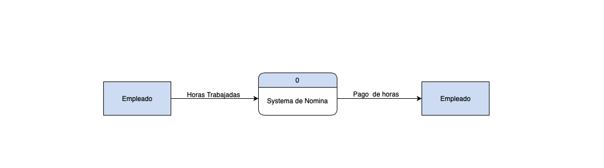
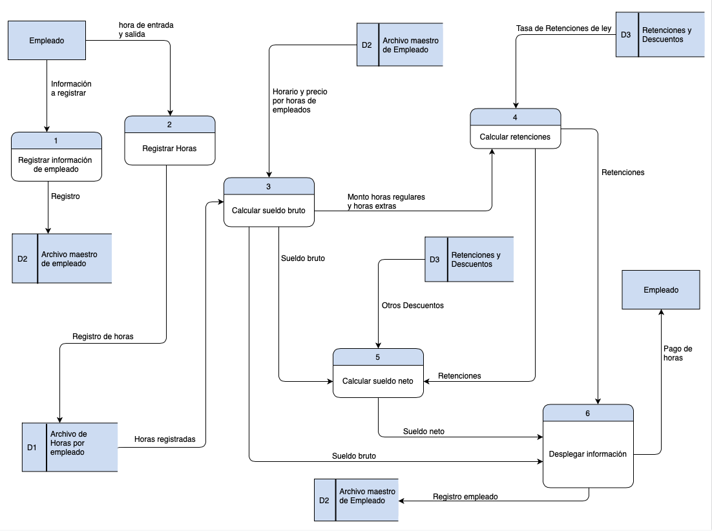
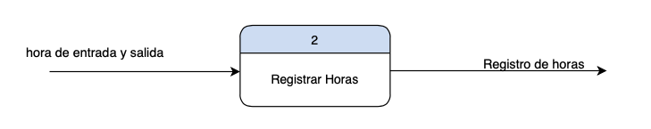
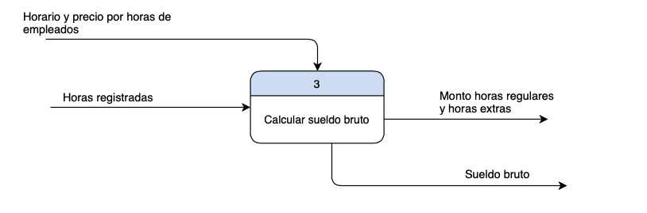
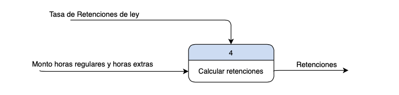
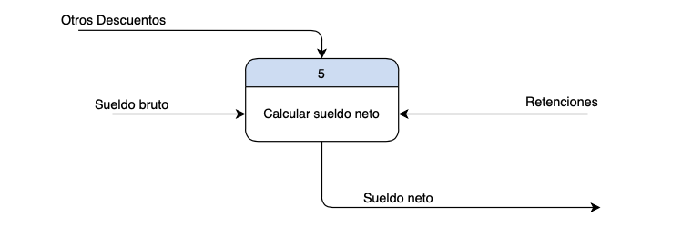
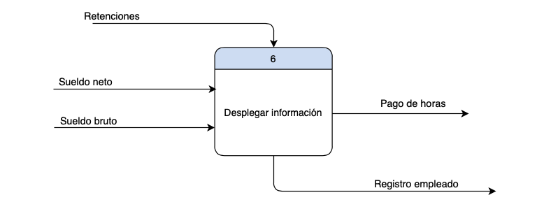

# 4. Descripción del Sistema de Información a analizar

## Descripción del Sistema de Información (SI)

El sistema de informacion que se esta desarrollando es un sisitema de nomina, nuestro sistema por el momento solo contara con algunas de las funciones esenciales de una nomina, por lo que el registro de entrada y salida de cada empleado debera ser llevado por algun otro sistema y luego esta informacion debera ser alimentada a nuestro sistema para el posterior calculo de la remuneracion a recibir por cada empleado.

**Nuestro sistema debe cumplir con los siguientes requerimientos.**

- Debe permitir el registro de la fecha de ingreso o contratacion del empeado a la empresa, su salario por hora, su horario de trabajo, el puesto o departamento en el que labora, e informacion basica del empleado como lo son: nombre, cedula, estado civil, entre otros.

- Debe calcular las horas trabajadas en el dia en base al registro de la hora de llegada y salida del empleado.

- Calculara tambien el sueldo bruto en base a las horas trabajadas en el periodo de pago, tambien calculara sueldo neto, e impuestos y aportes a la seguridad social, y demas descuentos de ley.

- El sistema tambien debe calcular el sueldo a pagar por concepto de horas extras y la facilidad de especificar el precio o valor a pagar por cada hora extra de trabajo.

- Por ultimo debera mostrar un informe detallado de la remuneracion que debe recibir el empleado.

## Diagrama de Flujo de Datos (incluye nivel 0 y 1)

**Diagrama de Flujo de Datos nivel 0**

 

**Diagrama de Flujo de Datos nivel 1**

 

## Narrativa de los Procesos mostrados en el Diagrama de Flujo de Datos(DFD)

`Proceso 1: Registrar informacion de empleado`

Description: Tienen como tarea capturar toda la informacion del empleado, nombre, identificacion, fecha de ingreso a la compañia, el horario, el puesto a o area en la que desempeñara sus funciones, la cantidad de dinero que cobra por hora normal, y por hora extra, estado civil, direccion, numero de contacto entre otros. Y a la salida almacena dichos datos en el **Archivo maestro de empleado**.

 

`Proceso 2: Registrar horas`

Descripcion: Este se encarga de calcular las horas trabajadas en el dia, de acuerdo a la hora de entrada y a la hora de salida del empleado, esta informacion luego sera almacenada en el Archivo de Horas por empleado.

 

`Proceso 3: Calcular sueldo bruto`

Descripcion: Se alimenta de **D1** para obtener el registro de las horas trabajadas por el empleado, tambien recibe desde **D2** informacion sobre el horario del empleado y el precio o tarifa de las horas regulares y las horas extras, de esta manera puede determinar cuantas horas son horas regulares y cuantas son horas extras y tambien el monto a pagar por cada una respectivamente, luego suma ambos resultados para asi obtener el sueldo bruto.

`Proceso 4: Calcular retenciones`

Descripcion: Se encarga de calular las retenciones de ley (AFP, SFS, IRS) en base al total a pagar por concepto horas regulares y horas extras.

`Proceso 5: Calcular sueldo neto`

Descripcion: La tarea de este subproceso es la de tomar el sueldo bruto, las retenciones calculadas y algun otro descuento aplicada a algun empleado y con esta informacion determinar el sueldo neto a pagar.

 

`Proceso 6: Desplegar informacion`

Descripcion: Consolidar la informacion sobre sueldo neto, suueldo bruto, retenciones y descuentons, mostrar dicha informacion al usuario y registrarla en nuestra base de datos.

[Go back](../README.md)
