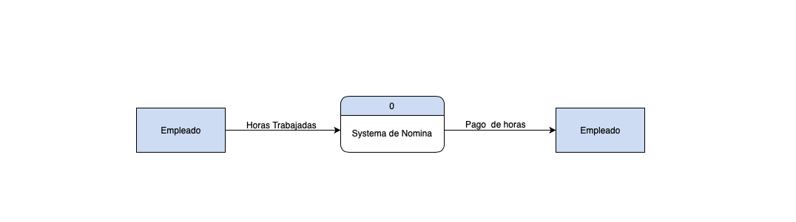
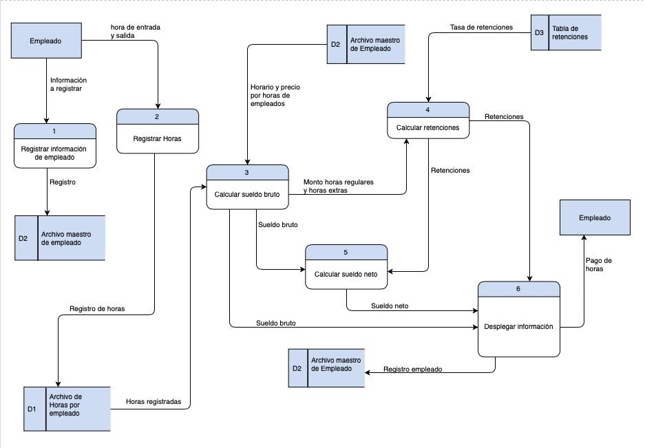
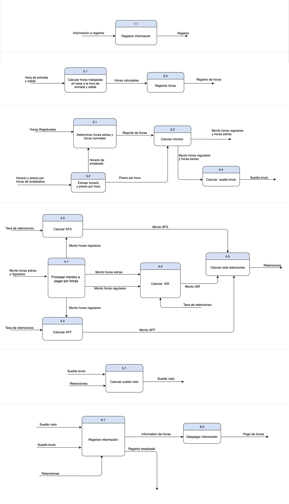
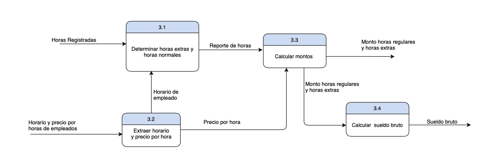
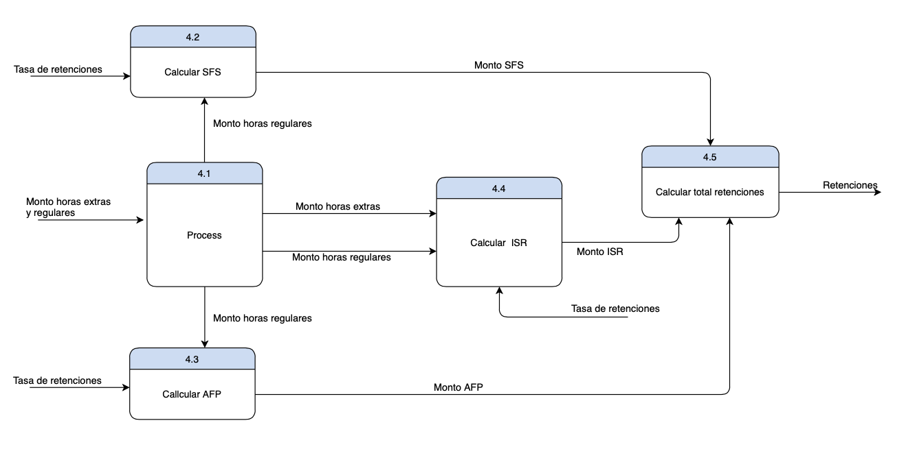
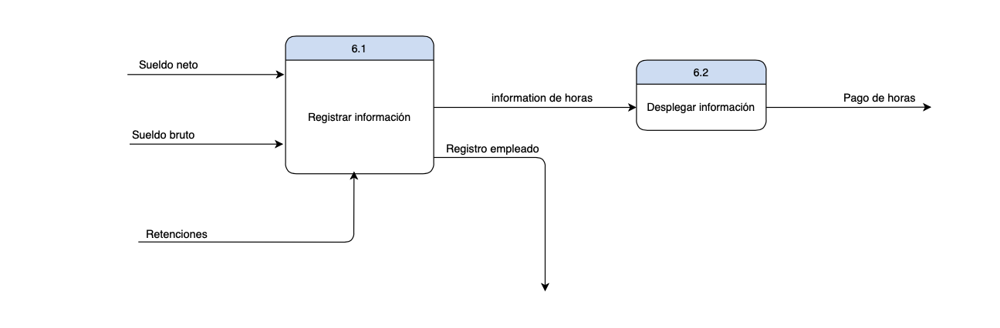

# 4. Descripción del Sistema de Información a analizar

## Descripción del Sistema de Información (SI)

El sistema de informacion que se esta desarrollando es un sisitema de nomina, nuestro sistema por el momento solo contara con algunas de las funciones esenciales de una nomina, por lo que el registro de entrada y salida de cada empleado debera ser llevado por algun otro sistema y luego esta informacion debera ser alimentada a nuestro sistema para el posterior calculo de la remuneracion a recibir por cada empleado.

**Nuestro sistema debe cumplir con los siguientes requerimientos.**

- Debe permitir el registro de la fecha de ingreso o contratacion del empeado a la empresa, su salario por hora, su horario de trabajo, el puesto o departamento en el que labora, e informacion basica del empleado como lo son: nombre, cedula, estado civil, entre otros.

- Debe calcular las horas trabajadas en el dia en base al registro de la hora de llegada y salida del empleado.

- Calculara tambien el sueldo bruto en base a las horas trabajadas en el periodo de pago, tambien calculara sueldo neto, e impuestos y aportes a la seguridad social, y demas descuentos de ley.

- El sistema tambien debe calcular el sueldo a pagar por concepto de horas extras y la facilidad de especificar el precio o valor a pagar por cada hora extra de trabajo.

- Por ultimo debera mostrar un informe detallado de la remuneracion que debe recibir el empleado.

## Diagrama de Flujo de Datos (incluye nivel 0 y 1)

**Diagrama de Contexto**

 

**Diagrama de Flujo de Datos nivel 0**

 

**Diagrama de Flujo de Datos nivel 1**

 

## Narrativa de los Procesos mostrados en el Diagrama de Flujo de Datos(DFD)

`Proceso 1: Registrar informacion empleado`

Subproceso 1.1: Gregistro informacion  
Description: Tienen como tarea capturar toda la informacion del empleado, nombre, identificacion, fecha de ingreso a la compañia, el horario, el puesto a o area en la que desempeñara sus funciones, la cantidad de dinero que cobra por hora normal, y por hora extra, estado civil, direccion, numero de contacto entre otros. Y a la salida almacena dichos datos en el **Archivo maestro de empleado**.

 

`Proceso 2: Registrar horas`

Subproceso 2.1: Calcular horas trabajadas  
Descripcion: Este se encarga de calcular las horas trabajadas en el dia, de acuerdo a la hora de entrada y a la hora de salida del empleado, esta informacion luego sera alimentada al subproceso 2.2.

Subproceso 2.2: Registrar horas  
Description: Este toma las horas calculadas en el proceso anterior y las almacena en el Archivo de Horas por empleado.

 

`Proceso 3: Calcular sueldo bruto`

Subproceso 3.1: Determinar horas extra y regulares  
Descripcion: Sealimenta de **D1** para obtener el registro de las horas registradas, tambien recibe informacion sobre el horario del empleado proveniente del proceso 3.2, de esta manera puede determinar cuantas horas son horas regulares y cuantas son horas extras, esta informacion sera enviad como "Reporte de horas" al subproceso 3.3.

Subproceso 3.2: Extraer horario y precio por hora  
Descripcion: recibe informacion desde **D2** para obtener el horario el empleado que sera enviado al subproceso 3.1 y tambien enviar informacion sobre cuanto cobra el empleado por hora, ya sea regular o extra, esta otra informacion debe ser enviada al subproceso 3.3.

Subproceso 3.3: Calcular montos  
Descripcion: Luego de obtener la informacion sobre cuantas horas son horas normales, cuantas son horas extras y el precio que debe pagarce por cada hora, este proceso procedera a calcular los montos a pagar por concepto de horas regulares y horas extras.

Subproceso 3.4: Calcular sueldo bruto  
Descripcion: Este proceso ya solo tendria que sumar los montos a pagar por horas regulares y horas extras, y asi producir el sueldo o salario bruto. Esto no se realiza en el subproceso 3.3 debido a que quiero alimentar esa informacion por separado al **proceso 4**.

`Proceso 4: Calcular retenciones`

Subproceso 4.1: Procesar montos a pagar por horas  
Descripcion: Debido a que ciertas retenciones se calculan solo en base a las horas regulares, como el AFP y el SFS, y otras se calculan en base a horas regulares y horas extras, este proceso se encargar de los montos adecuados a los demas subprocesos.

Subproceso 4.2: Calcular SFS  
Descripcion: Recibe el valor de la tasa de descuento del SFS desde **D3**, y el monto a pagar por horas regulares, con esta informacion calcula el monto a retener por concepto de Seguro Familiar de Salud.

Subproceso 4.3: Calcular AFP  
Descripcion: Calcula el monto a retener para la Administradora de Fondos de Pensiones, con los valores provistos por el subproceso 4.1 y 4.2 y la informacion proveniente de **D3**.

Subproceso 4.4: Calcular ISR  
Descripcion: Calcular el impuesto sobre la renta sobre el salario en bruto, el cual puede obtenerse a partir de los montos de horas regulares y horas extras, y la informacion sobre la tasa de contribucion proveniente de **D3**

Subproceso 4.5: Cacular total retenciones  
Descripcion: conlos valores obtenidos de los subprocesos anteriores calcular el monto total de las retenciones a aplicar al sueldo del empleado.

`Proceso 5: Calcular sueldo neto`

Subproceso 5.1: Calcular sueldo neto  
Descripcion: La tarea de este subproceso es la de tomar el sueldo bruto y las retenciones conrespondientes y determinar el sueldo neto.

 

`Proceso 6: Desplegar informacion`

Subproceso 6.1: Registrar informacion  
Descripcion: Consolidar la informacion sobre sueldo neto, suueldo bruto y retenciones. Registrar esta informacion en el registro del empleado y generar un informe que sera enviado al subproceso 6.2.

Subproceso 6.2: Desplegar informacion  
Descripcion: Muestra un informe sobre el pago a realizar al empleado.
