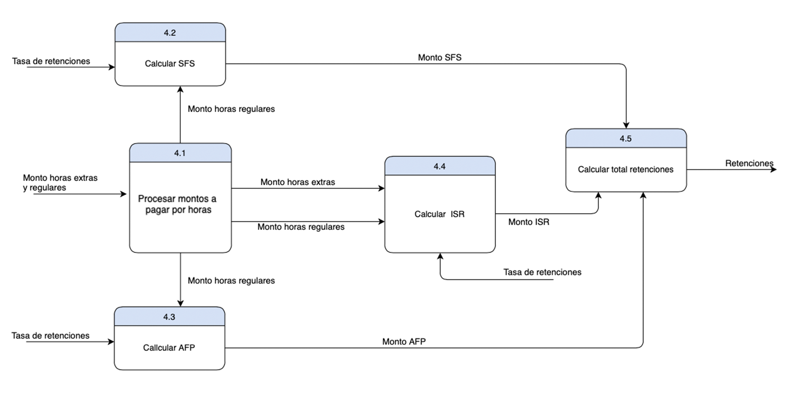

# 4. Descripción del Sistema de Información a analizar

## Descripción del Sistema de Información (SI)

El sistema de informacion que se esta desarrollando es un sisitema de nomina, el cual le permitira a la propietaria del negocio **(reconsiderar usar el nombre del dueño aqui)** llevar la nomina del negocio. nuestro sistema por el momento solo contara con algunas de las funciones esenciales de una nomina, por lo que el registro de entrada y salida de cada empleado debera ser llevado por algun otro sistema y luego esta informacion debera ser alimentada a nuestro sistema para el posterior calculo de la remuneracion a recibir por cada empleado.

**Nuestro sistema debe cumplir con los siguientes requerimientos.**

- debe permitir el registro de la fecha de ingreso o contratacion del empeado a la empresa, su salario por hora, su horario de trabajo, el puesto o departamento en el que labora, e informacion basica del empleado como lo son: nombre, cedula, estado civil.

- debe calcular las horas trabajadas en el dia en base al registro de la hora de llegada y salida del empleado, asi como tambien su sueldo bruto, neto, e impuestos y aportes a la seguridad social, y demas descuentos de ley, ademas de descuentos adicionales debidos inacistancias, horarios incompletos o bien alguna otra causa a especificar por el empelador.

- el sistema tambien debe calcular el sueldo a pagar por concepto de horas extras y la facilidad de especificar el precio o valor a pagar por cada hora extra de trabajo.

- debe ser capaz de calcular el salario de vacaciones asi como tambien el sueldo numero 13, cumpliendo siempre con lo establezido en la ley para el pago de los mismos asi como tambien para el pago de impuestos y seguro de salud.

- debe permitir la creacion de informes del historial de horas trabajadas en un periodo establecido, asi como el historial de salarios recibidos por cada empleado.

- debe permitir la asignacion de bonificaciones especiales las cuales su valor monetario y descripcion o razon de ser, sera especificado por el propietario del negocio o bien administrador de la nomina.

- el programa debe permitir la creacion de usarios para el manejo del sistema, asi el manejo de la nomina podria ser delegada a un empelado en particular que este capacitado.

- al despedir un empleado y especificar la fecha en la que dicho empleado fue despedido, el programa debera de acuerdo a la razon provista del despido, calcular la remuneracion que debe ser pagada al empleado simpre apegado a lo establesido en la ley.

## Diagrama de Flujo de Datos (incluye nivel 0 y 1)

**Diagrama de Contexto**

 

**Diagrama de Flujo de Datos nivel 0**

 

**Diagrama de Flujo de Datos nivel 1**

 

## Narrativa de los Procesos mostrados en el Diagrama de Flujo de Datos(DFD)

`Proceso 1: Registrar_Informacion_Empleado`

Subproceso 1.1: Gregistro_Informacion
Description: Tienen como tarea capturar toda la informacion del empleado, nombre, identificacion, fecha de ingreso a la compañia, el horario, el puesto a o area en la que desempeñara sus funciones, la cantidad de dinero que cobra por hora normal, y por hora extra, estado civil, direccion, numero de contacto entre otros. Y a la salida almacena dichos datos en el **Archivo maestro de empleado**.

 

`Proceso 2: Registrar_Horas`

Subproceso 2.1: Calcular_Horas_Trabajadas
Descripcion: Este se encarga de calcular las horas trabajadas en el dia, de acuerdo a la hora de entrada y a la hora de salida del empleado, esta informacion luego sera alimentada al subproceso 2.2.

Subproceso 2.2: Registrar_Horas
Description: Este toma las horas calculadas en el proceso anterior y las almacena en el Archivo de Horas por empleado.

 

`Proceso 3: Calcular_Sueldo_Bruto`

Subproceso 3.1: Determinar_horas_extra_y_regulares
Descripcion: Sealimenta de D1 para obtener el registro de ls

