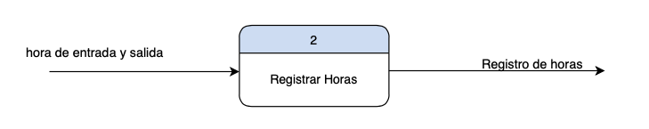
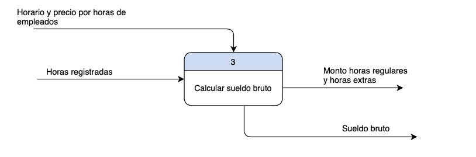
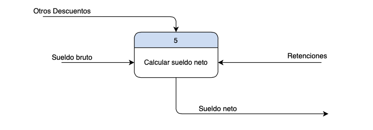

# 7. Crear el Diccionario de Datos del Sistema de Información
`Proceso 1`

<xmp>Informacion a registrar = nombre + apellido + edad + sexo + estado civil </xmp>
<xmp>                          + cedula + numero seguridad social + direccion </xmp>
<xmp>                          + puesto a desempeñar + Horario + Numero de contacto </xmp>
<xmp>                          + precio por hora regular + precio por hora extra </xmp>
 
`Proceso 2`

Hora de entrada y salida = Hora de entrada + Hora de salida
 
Registro de Horas = cantidad de horas trabajadas

 

`Proceso 3`

Horario y precio por horas de empleado = Horario del empleado + precio de hora regular + precio de hora extra
 
Horas registradas = total de horas trabajadas por el empleado
 
Monto horas regulares y horas extras = Monto a pagar por horas regulares + monto a pagar por horas extras  
Sueldo bruto = Sueldo total antes de restar las retenciones de ley y demas descuentos

 

`Proceso 4`

Tasa de retenciones de ley = tasa de AFP + tasa de SFS + tasa de ISR  
Retenciones = Monto a pagar por concepto de AFP, SFS e ISR

 

`Proceso 5`

Otros Descuentos = Cualquier otro descuento que deba aplicarse al empleado  
Sueldo neto = sueldo restante luego de deducir las retenciones de ley y demas descuentos.

 
